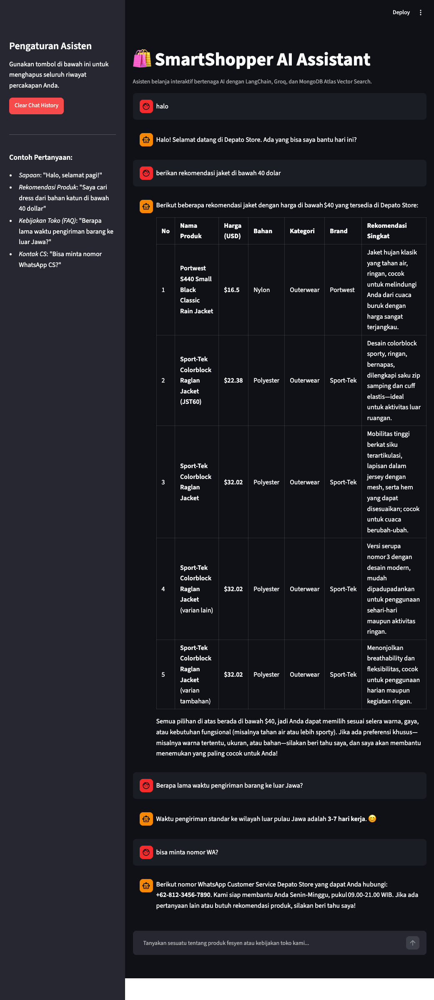
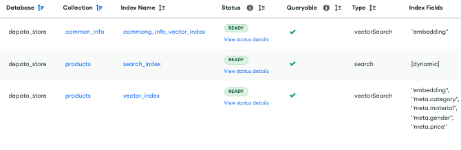

# 🛍️ SmartShopper AI Assistant: Intelligent Fashion Recommendation & CS Agent

SmartShopper AI Assistant adalah sistem agen belanja pintar (AI Shop Assistant) yang dirancang untuk toko fesyen online **Depato Store**. Aplikasi ini dibangun menggunakan **LangChain** (sebagai kerangka kerja orkestrasi agen), **Groq Cloud API** dengan model **LLM Llama 3.3 (70B)** sebagai motor penalaran, serta **MongoDB Atlas Vector Search** sebagai basis data vektor penyimpan produk dan FAQ (kebijakan toko).

---

## 🌟 Fitur Utama

1.  **Orkestrasi Agen Cerdas (LangChain & LangGraph)**: Secara dinamis menentukan tindakan terbaik berdasarkan pertanyaan pengguna.
2.  **Klasifikasi & Routing Kueri Otomatis**:
    *   **Obrolan Santai / Sapaan**: Dijawab langsung oleh agen tanpa memanggil database (hemat token).
    *   **Rekomendasi Produk**: Memicu tool `product_recommendation` untuk mencari produk fesyen di database.
    *   **Informasi Umum / Kebijakan Toko (FAQ)**: Memicu tool `common_information` untuk menjawab detail pengiriman, pengembalian barang, refund, pembayaran, atau kontak CS.
3.  **Parafrasa Kueri Dinamis (Query Paraphrasing)**: Menulis ulang kueri user berdasarkan riwayat obrolan (chat history) agar pencarian di database tetap akurat secara konteks (few-shot optimized).
4.  **Filter Metadata Cerdas (Pre-filtering)**: LLM mengekstrak preferensi belanja user (kategori pakaian, bahan kain, gender, harga) menjadi filter kueri MongoDB Atlas untuk mempersempit pencarian sebelum pencarian vektor dilakukan.
5.  **Multi-Interface**: Tersedia antarmuka web interaktif menggunakan **Streamlit** serta backend REST API dengan **FastAPI**.

---

## 🏗️ Arsitektur Sistem

Sistem ini terbagi menjadi 3 komponen utama:
1.  **Database Layer (MongoDB Atlas)**: Menyimpan dokumen produk dan informasi umum toko lengkap dengan representasi vektor embeddings-nya (768 dimensi menggunakan model `all-mpnet-base-v2` dari SentenceTransformers).
2.  **Core Agentic Logic (`src/`)**:
    *   [config.py](src/config.py): Konfigurasi variabel lingkungan secara aman (.env).
    *   [database.py](src/database.py): Abstraksi koneksi pymongo dan logika pencarian `$vectorSearch` dengan pre-filtering.
    *   [agent.py](src/agent.py): Definisi agen LangChain beserta pendaftaran tools dan system prompt.
    *   [pipelines/](src/pipelines/): Modul pembantu untuk melakukan ekstraksi filter metadata, RAG produk, dan RAG FAQ.
3.  **Interface Layer (`website/`)**:
    *   [app.py](website/app.py): Aplikasi frontend chatbot berbasis Streamlit.
    *   [api.py](website/api.py): Endpoint backend REST API berbasis FastAPI.

---

## 💾 Proses Penyimpanan Data (Storing Data)

Seluruh proses pembersihan, pemformatan, pembuatan vektor embedding, dan seeding database dikelola oleh skrip mandiri: **[store_data.py](scripts/store_data.py)**.



### Alur Kerja `store_data.py`:
1.  **Koneksi Database**: Menghubungkan ke cluster MongoDB Atlas menggunakan string koneksi aman (`MONGO_CONNECTION_STRING`).
2.  **Seeding Data Produk**:
    *   Membaca file dataset mentah `data/datasets.pkl` (kumpulan data produk fashion Amazon).
    *   Membersihkan data yang tidak memiliki judul (`title`) atau bernilai null.
    *   Menggabungkan judul produk dan deskripsi ke dalam satu string `content`.
    *   Menghitung vektor embedding dari string `content` menggunakan model embeddings `all-mpnet-base-v2` (768 dimensi).
    *   Menyimpan dokumen lengkap beserta metadata (`brand`, `price`, `gender`, `material`, `category`) dan array `embedding` ke dalam koleksi **`products`**.
    *   Menyaring daftar material dan kategori unik untuk disimpan di koleksi pendukung **`materials`** dan **`categories`** (sebagai referensi filter LLM).
3.  **Seeding Data FAQ (Common Information)**:
    *   Membaca file data kebijakan toko `data/common_info.json` (berisi 12 FAQ aturan belanja Depato Store dalam Bahasa Indonesia).
    *   Menggabungkan pertanyaan dan jawaban menjadi format terpadu: `Question: {question}\nAnswer: {answer}`.
    *   Menghitung vektor embedding untuk masing-masing item FAQ.
    *   Menghapus data FAQ lama di koleksi **`common_info`** (untuk menghindari duplikasi) dan menyisipkan data baru yang telah memiliki bidang `embedding`.

### Definisi Vector Search Index (MongoDB Atlas):

Untuk menjalankan pencarian vektor, Anda perlu membuat dua indeks pencarian vektor (Atlas Vector Search Index) berikut di MongoDB Atlas:

#### 1. Indeks Koleksi `products` (Nama: `vector_index`)
```json
{
  "fields": [
    {
      "numDimensions": 768,
      "path": "embedding",
      "similarity": "cosine",
      "type": "vector"
    },
    {
      "path": "meta.category",
      "type": "filter"
    },
    {
      "path": "meta.material",
      "type": "filter"
    },
    {
      "path": "meta.gender",
      "type": "filter"
    },
    {
      "path": "meta.price",
      "type": "filter"
    }
  ]
}
```

#### 2. Indeks Koleksi `common_info` (Nama: `common_info_vector_index` atau `commong_info_vector_index`)
```json
{
  "fields": [
    {
      "numDimensions": 768,
      "path": "embedding",
      "similarity": "cosine",
      "type": "vector"
    }
  ]
}
```

---

## 🚀 Petunjuk Menjalankan Aplikasi

### Persyaratan Awal (Prerequisites)
*   Python 3.10 ke atas
*   Kunci API Groq (GROQ_API_KEY)
*   Koneksi cluster MongoDB Atlas (MONGO_CONNECTION_STRING)

### Konfigurasi `.env`
Buat berkas `.env` di root direktori proyek Anda dengan format berikut:
```env
GROQ_API_KEY="gsk_xxx..."
MONGO_CONNECTION_STRING="mongodb+srv://..."
# GROQ_MODEL="llama-3.3-70b-versatile" (Opsional, bawaan: llama-3.3-70b-versatile)
```

---

### Opsi A: Menjalankan Secara Lokal

1.  **Instal Dependensi**:
    ```bash
    pip install -r requirements.txt
    ```
2.  **Seeding Data** (Jika koleksi MongoDB Anda masih kosong):
    ```bash
    python scripts/store_data.py
    ```
3.  **Jalankan Streamlit Chat UI**:
    ```bash
    streamlit run website/app.py
    ```
    Buka peramban di alamat: [http://localhost:8501](http://localhost:8501)
4.  **Jalankan FastAPI Backend REST API**:
    ```bash
    uvicorn website.api:app --reload
    ```
    Akses Swagger Docs di: [http://localhost:8000/docs](http://localhost:8000/docs)

---

### Opsi B: Menjalankan dengan Docker Compose (Sangat Praktis)

Kami menyediakan konfigurasi Docker Compose yang teroptimasi khusus untuk platform CPU (seperti Macbook M1/M2/M3) dengan menggunakan *CPU-only PyTorch index* untuk mempercepat proses build.

1.  **Bangun & Jalankan Container**:
    ```bash
    docker-compose up --build -d
    ```
2.  **Akses Aplikasi**:
    *   **Streamlit Chatbot UI**: [http://localhost:8502](http://localhost:8502) (Port eksternal diatur ke **8502** untuk menghindari bentrok port lokal).
    *   **FastAPI REST API**: [http://localhost:8001](http://localhost:8001) (Port eksternal diatur ke **8001**).
    *   **API Healthcheck**: [http://localhost:8001/health](http://localhost:8001/health)
3.  **Matikan Container**:
    ```bash
    docker-compose down
    ```
